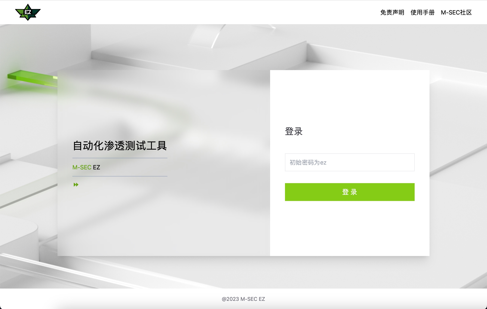

# EZ

<p align="center">
</p>  
<p align="center">


</p>  

EZ是一款集信息收集、端口扫描、服务暴破、URL爬虫、指纹识别、被动扫描为一体的跨平台漏洞扫描器，渗透测试中，可辅助发现常见的SQL注入、XSS、XXE、SSRF之类的漏洞，通过内置的POC辅助发现Apache Shiro、RabbitMQ、Struts2之类的通用组件漏洞，以及某服VPN、通达OA以及泛微OA之类的被曝出已知漏洞的系统，可谓是外围打点，破局进内网，全面发现漏洞的渗透测试必备武器，EZ在手，shell我有。



> 注意：EZ 仅提供社区版使用，开放但源码不开源，用户可通过 M-SEC 社区官方或 Github 下载构建好的二进制文件使用。

## 使用下载

* [使用文档](https://msec.nsfocus.com/ezdocs/)
* [M-SEC 社区在线下载](https://msec.nsfocus.com/?EZCommunity/)

> EZ 使用需通过证书进行授权，用户可注册 M-SEC 社区（[https://msec.nsfocus.com/](https://msec.nsfocus.com/)）后在个人中心申请证书，每次仅能申请 1 个月使用期，证书申请后放至 EZ 同目录即可启动使用。

### Usage

使用 `./ez -h` 可查看 EZ 用法，如需要查看单个模块用法可使用 `./ez [模块] -h` 查看。

```
EEEEEEEEEEEEEEEEEEEEEEZZZZZZZZZZZZZZZZZZZ
E::::::::::::::::::::EZ:::::::::::::::::Z
E::::::::::::::::::::EZ:::::::::::::::::Z
EE::::::EEEEEEEEE::::EZ:::ZZZZZZZZ:::::Z
  E:::::E       EEEEEEZZZZZ     Z:::::Z
  E:::::E                     Z:::::Z
  E::::::EEEEEEEEEE          Z:::::Z
  E:::::::::::::::E         Z:::::Z
  E:::::::::::::::E        Z:::::Z
  E::::::EEEEEEEEEE       Z:::::Z
  E:::::E                Z:::::Z
  E:::::E       EEEEEEZZZ:::::Z     ZZZZZ
EE::::::EEEEEEEE:::::EZ::::::ZZZZZZZZ:::Z
E::::::::::::::::::::EZ:::::::::::::::::Z
E::::::::::::::::::::EZ:::::::::::::::::Z
EEEEEEEEEEEEEEEEEEEEEEZZZZZZZZZZZZZZZZZZZ

Easy verify, Easy exploit.

Version: 1.8.6-social/64802d15/Professional Edition Build:2023

NAME:
   ez - A powerful scanner engine

USAGE:
   ez [global options] command [command options] [arguments...]

DESCRIPTION:
   A powerful scanner engine

COMMANDS:
   webscan         Run a webscan task
   servicescan     Run a service scan task
   dnsscan         Run a dns scan task,gather subdomain
   brute           Run a brute service scan task
   reverse         Run a standalone reverse server
   web             Run a web server
   tools           Run a tool
   crawler         Run a crawler task
   machineid, mid  generate machineid
   help, h         Shows a list of commands or help for one command

GLOBAL OPTIONS:
   --log-level value, -l value  Log level, choices are debug, info, warn, warning, success (default: "info")
   --config value, -c value     Load ez configuration from file (default: "config.yaml")
   --lic value                  ez license file (default: "ez.lic")
   --check-reverse              check reverse service is online,finish it will exit program (default: false)
   --help, -h                   show help
```

## 工具模块介绍

### `webscan` 模块

支持通用程序、通用框架的指纹识别。支持常规漏洞和通用漏洞的扫描，内置Headless爬虫。

1. 主动扫描

    ```
    ./ez webscan --pocs sqli -u "http://www.example.com"
    ```

2. 被动扫描

    ```
    ./ez webscan
    ```
    
    **指定poc**

    ```
    ./ez webscan --pocs sqli
    ```

3. 仅指纹识别

    ```
    ./ez webscan --disable-pocs all -u "http://www.example.com"
    ```

4. 忽略指纹识别

    ```
    ./ez webscan -u "http://www.example.com" -nff
    ```

### `servicescan` 模块

支持端口扫描、服务识别以及漏洞扫描。

```
./ez servicescan --hosts 192.168.11.111 --ports 445
```

### `dnsscan` 模块

支持 API 形式和枚举形式的子域名信息搜集。

```
./ez dnsscan -d example.com
```

### `brute` 模块

支持多种协议的爆破。

```
./ez brute --hosts 192.168.11.111:22:ssh --users root --passwords root
```


### `reverse` 模块

支持单机部署反连平台。

反连平台部署教程可参考：https://msec.nsfocus.com/ezdocs/docs/EZUSE/ez-reverse

### `crawler` 模块

支持 headless 形式的爬虫。

1. 不需要登录的场景

    ```
    ./ez crawler -u "http://www.example.com/index.php"
    ```

2. 需要登录的场景

    ```
    ./ez crawler -u "http://www.example.com/index.php" --wait-login
    ```

### `web` 模块

支持 web 界面对 ez 功能进行操作，也可以进行任务一键下发。

```
./ez web
```

> EZ 从 1.5.0 版本开始使用 ez web 在启动时会默认设置安全路径为随机串，第一次需访问安全路径后才可正常登录，如果不想有安全路径则添加 `--no-safe-path` 参数，也可以使用 `--safe-path` 自定义安全路径.

更多 EZ 使用技巧及高阶用法可参考在线文档：https://msec.nsfocus.com/ezdocs/

## EZ 特性

1. 多维度资产及信息搜集：子域名、IP端口、URL、指纹识别...EZ一网打尽，又快又全。
2. 通用型漏洞检测：SQL注入、XSS、Java反序列化、Log4j2、命令注入...EZ让它无处藏身。
3. 原生协议识别：通过协议交互的最底层获取服务信息，丰富的指纹识别广度和精确度，在EZ火眼金睛下一一显形！
4. 多维度通用系统指纹探测识别：采用自主研发的基于主动HTTP畸形报文响应的指纹识别技术，精准识别到组件最核心的功能点。EZ妙不可言!
5. HTTP Request Reduce技术：通过采用指纹识别后发送PoC、PoC发包数量优化等手段，将单个漏洞的HTTP请求数量控制在最小化程度，精准切入，最大程度规避在扫描时引发的业务连续性影响。EZ用的放心！
6. POC自定义：支持基于YAML、Go 的自定义PoC 编写方案，开放PoC编写文档。可通过轻量代码快速构建Web漏洞扫描插件，此外还同时支持TCP层相关协议漏洞的插件开发。EZ用法灵活！
7. M-SEC社区支持：依靠M-SEC社区每日最新漏洞情报，不断优化和提升EZ工具的插件和使用效率，增强实战应用。同时，加入M-SEC社区还可交流EZ使用技巧，分享技术文章，探索更多安全知识。

## M-SEC 社区

### EZ POC 辅助编写

EZ 支持 `指纹`、`yaml poc`、`golang poc`自定义编写功能，用户可参考 EZ 使用文档编写自定义指纹或 POC 使用，也可使用 M-SEC 社区在线辅助 POC 编写功能进行自定义 POC 的编写。

* EZ 在线使用手册：https://msec.nsfocus.com/ezdocs/
* 在线辅助 POC 编写：https://msec.nsfocus.com/?ezpocgenerate/

### 漏洞提交：

M-SEC 社区长期征集通用系统漏洞、EZ POC 插件以及原创技术文章，一经收录均可获得 M-SEC 社区积分奖励以及其它定制礼品。

漏洞提交奖励规则可参考：https://msec.nsfocus.com/?RewardRules/

## 官方支撑团队

我们是一群攻防技术爱好者，在红队里我们是最懂开发的，在开发里我们是最懂攻防的，我们来自绿盟科技，技术赋能社区，我们抱着开放的态度，欢迎各位加入，一起建设。

| 用户       | 角色              |
|------------|-------------------|
| [@1oid](https://github.com/1oid)      | 官方研发成员      |
| @Blackhold | 官方研发成员      |
| [@BUG-Fly](https://github.com/Fly-Playgroud) | 官方研发成员      |
| [@caicai](https://github.com/amcai/)  | 官方研发成员      |
| @do9gy     | 官方研发成员      |
| @Jinchi    | 官方研发成员      |
| @ZHL       | 官方研发成员      |
| [@zitn](https://github.com/zitn)      | 官方研发成员      |
| [@buding00](https://github.com/buding00)  | M-SEC社区核心成员 |

## 扫码关注 M-SEC 社区公众号，发送关键字 “EZ” 加入 M-SEC 社区交流群。


## 免责申明

1、本软件仅用于经授权的渗透测试使用，请在使用本工具进行渗透测试前，必须获得直接测试目标单位的书面授权。非经被测试目标单位授权，禁止使用本工具实施任何未经许可的测试行为。

2、用户通过使用本软件所获取的任何资产或漏洞等信息，必须严格按照测试目标单位的要求予以处理，未经许可不得对信息另行加工、对外传输提供及非法公开。

3、本软件通过提交申请信息，提供证书授权给用户使用，默认授权使用时间为1个月，禁止任何形式的复制、分发和传播该证书。用户应对授权期间的使用行为负责，如未取得被测试目标单位的授权或随意复制、分发及传播该证书致使本软件被他人恶意使用而导致的违法责任，用户应依法承担相应责任。

4、禁止对本软件实施逆向工程、反编译、篡改软件认证流程和试图破译源代码等行为，通过前述行为恶意绕开软件使用的管控限制。

5、如发现用户您有上述禁止行为，或者在使用本软件过程中存在任何非法行为，我们将保留追究用户您法律责任的权利，并将配合执法单位提供证据材料，追究违法责任。

6、我们已对软件使用合规要件做了充分提示，具体详见前第1-4项内容，如用户违法前述要求导致的任何责任，与我们无关，将由用户自行承担全部责任。 为保证软件使用行为即渗透测试行为的可追溯，本软件在使用期间将有限收集个人PC信息，包括MAC地址、本机IP地址以及启动时间等，必要时将提供政府监管部门，请用户知悉。


